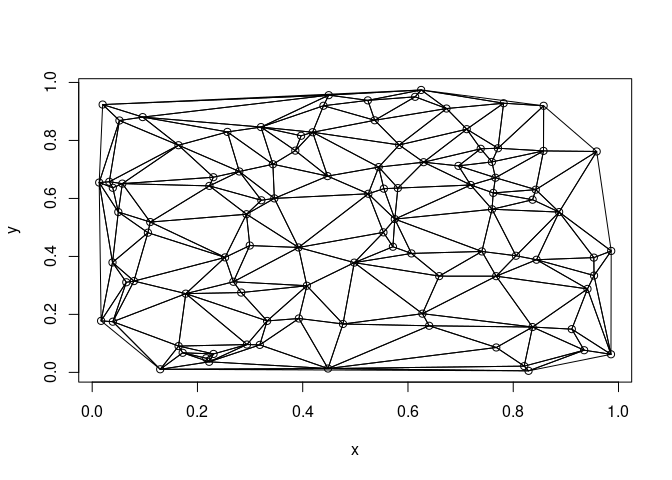

<!-- README.md is generated from README.Rmd. Please edit that file -->

# delone

<!-- badges: start -->

[](https://github.com/hypertidy/delone/actions)
<!-- badges: end -->

The goal of delone is to provide fast Delaunay triangulation of planar
coordinates (X,Y).

## Installation

You can install the development version from
[GitHub](https://github.com/) with:

``` r
# install.packages("devtools")
devtools::install_github("hypertidy/delone")
```

## Example

This is a basic example which shows usage.

`tri` is an integer vector of triangle triplets that index the input
vectors `x` and `y`.

``` r
x    <- runif(100)
y    <- runif(100)
library(delone)
tri <- xy_tri(x, y)
plot(x, y)
polygon(cbind(x, y)[rbind(matrix(tri, 3L), NA), ])
```



This suite shows speed comparisons.

delone is the fastest because CGAL is the fastest freely available
library for this.

``` r
library(delone)
n <- 10000
xy <- cbind(runif(n), runif(n))
## grid for akima
#grid <- expand.grid(x = seq(0, 1, length = as.integer(sqrt(n))), y = seq(0, 1, length = as.integer(sqrt(n))))

## these choice were
## 1) easy for me to try out
## 2)  pure Delaunay convex hull triangulation on bare points (akima is different, uses triangulation under the hood)
## 3) first published here: https://rpubs.com/cyclemumner/416456
rbenchmark::benchmark(
  ## akima doesn't really belong
  #akima = akima::interpp(xy[,1], xy[,2], z = rep(0, n), xo = grid$x, yo = grid$y),
  deldir = deldir::deldir(xy[,1], xy[,2], suppressMsge = TRUE),
  delone = delone::xy_tri(xy[,1], xy[,2]),
  geometry = geometry::delaunayn(xy, options = "Pp"),
  rgeos = rgeos::gDelaunayTriangulation(sp::SpatialPoints(xy)),
  RTriangle = RTriangle::triangulate(RTriangle::pslg(xy)),
  sf = sf::st_triangulate(sf::st_sfc(sf::st_multipoint(xy))),
  ## spatstat belongs but (was) the slowest (needs update to new spatstat.<family>)
  #spatstat = spatstat::delaunay(spatstat::ppp(xy[,1], xy[,2], window = spatstat::owin(range(xy[,1]), range(xy[,2])))),
  tripack = tripack::tri.mesh(xy[,1], xy[,2]),
  replications = 10,
  order = "relative",
  columns = c('test', 'elapsed', 'relative', 'user.self', 'sys.self')
)
#>        test elapsed relative user.self sys.self
#> 2    delone   0.124    1.000     0.124    0.000
#> 5 RTriangle   0.651    5.250     0.636    0.016
#> 7   tripack   0.756    6.097     0.755    0.000
#> 3  geometry   0.764    6.161     0.727    0.036
#> 6        sf  10.956   88.355    10.927    0.022
#> 4     rgeos  16.277  131.266    16.169    0.100
#> 1    deldir  40.263  324.702    40.118    0.133
```

(There are commercial versions in other software, and Manifold.net is
probably the beefiest and fastest of all.)

## Code of Conduct

Please note that the delone project is released with a [Contributor Code
of
Conduct](https://contributor-covenant.org/version/2/0/CODE_OF_CONDUCT.html).
By contributing to this project, you agree to abide by its terms.
